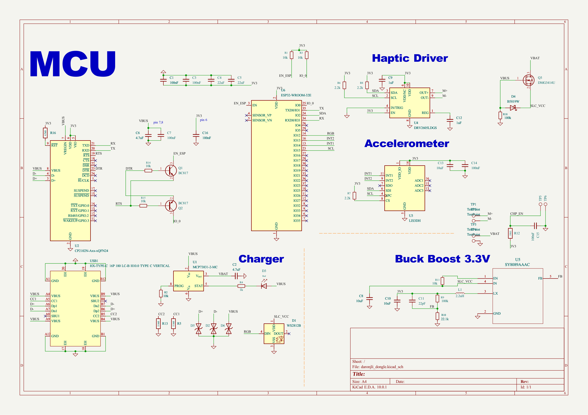

# daronjli_dongle_final_manufactured

ESP32 Bluetooth dongle with ERM haptic motor and accelerometer - FAULTY: wrong ORing circuit, used NMOS instead of PMOS

## At a Glance

- **Status**: Manufactured
- **Board size**: 23.26 x 28.39 mm
- **Layers**: 4
- **Components**: 56
- **Key ICs**:
  - U1: MCP73831-2-MC
  - U2: CP2102N-Axx-xQFN24
  - U3: LIS3DH
  - U4: DRV2605LDGS
  - U5: SY8089AAAC
  - U6: ESP32-WROOM-32E

## Schematic

Full PDF: [reports/schematic.pdf](reports/schematic.pdf)

## Component Roles

- **ESP32-WROVER-E** - main MCU with Bluetooth; firmware runs here
- **DRV2605LDGS** - haptic motor driver (configured for ERM motor) for tactile feedback
- **LIS3DH** - 3-axis accelerometer for orientation / motion detection
- **CP2102N** - USB-to-UART bridge for firmware programming
- **TPS63020** - buck-boost regulator (stable 3.3 V from a swinging LiPo)
- **MCP73871** - LiPo charger with PowerPath (USB vs battery source switching)
- **MAX17048** - I2C fuel gauge for battery percentage

## Known fault

This manufactured revision has a **broken OR-ing / PowerPath circuit**: the design used an N-channel MOSFET where a P-channel MOSFET was required. Result: source switching between USB and battery does not work correctly. Use the active [daronjli-dongle](https://github.com/manhoosbilli1/daronjli-dongle) repo for the fix.

## PCB

**Top copper**

**Bottom copper**

## Bill of Materials

| Refs | Value | Footprint | Qty | MPN | LCSC |
|------|-------|-----------|----:|-----|------|
| C1,C3,C7,C14-C16 | 100nF | Capacitor_SMD:C_0402_1005Metric | 6 |  |  |
| C2,C6 | 4.7uF | Capacitor_SMD:C_0402_1005Metric | 2 |  | [C307423](https://www.lcsc.com/product-detail/_C307423.html) |
| C4,C5 | 22uF | Capacitor_SMD:C_0402_1005Metric | 2 |  |  |
| C8,C10,C13 | 10uF | Capacitor_SMD:C_0402_1005Metric | 3 |  |  |
| C9,C12 | 1uF | Capacitor_SMD:C_0402_1005Metric | 2 |  |  |
| C11 | 22pF | Capacitor_SMD:C_0402_1005Metric | 1 |  |  |
| D1 | WS2812B | PCM_JLCPCB:LED_WS2812B_PLCC4_5.0x5.0mm_P3.2mm | 1 |  | [C22461793](https://www.lcsc.com/product-detail/_C22461793.html) |
| D2,D5,D6 | H5VL06B | PCM_JLCPCB:D_DFN0603-2L | 3 |  | [C7420373](https://www.lcsc.com/product-detail/_C7420373.html) |
| D3 | Red | PCM_JLCPCB:D_0603 | 1 |  | [C2286](https://www.lcsc.com/product-detail/_C2286.html) |
| D4 | B5819W | Diode_SMD:D_SOD-123 | 1 |  |  |
| L1 | 2.2uH | Inductor_SMD:L_1008_2520Metric_Pad1.43x2.20mm_HandSolder | 1 |  |  |
| Q1,Q2 | BC817 | Package_TO_SOT_SMD:SOT-23 | 2 |  |  |
| Q3 | DMG3414U | Package_TO_SOT_SMD:SOT-23 | 1 |  |  |
| R1-R3,R11,R14,R15 | 10k | Resistor_SMD:R_0402_1005Metric | 6 |  | [C60490](https://www.lcsc.com/product-detail/_C60490.html) |
| R4 | 1k | Resistor_SMD:R_0402_1005Metric | 1 |  | [C106235](https://www.lcsc.com/product-detail/_C106235.html) |
| R5,R13 | 5.1kΩ | PCM_JLCPCB:R_0402 | 2 |  | [C25905](https://www.lcsc.com/product-detail/_C25905.html) |
| R6-R8 | 2.2k | Resistor_SMD:R_0402_1005Metric | 3 |  |  |
| R9,R18 | 100k | Resistor_SMD:R_0402_1005Metric | 2 |  |  |
| R10 | 22.1k | Resistor_SMD:R_0402_1005Metric | 1 |  | [C43473](https://www.lcsc.com/product-detail/_C43473.html) |
| R12 | 10kΩ | PCM_JLCPCB:R_0402 | 1 |  | [C25744](https://www.lcsc.com/product-detail/_C25744.html) |
| R16 | 4.7kΩ | PCM_JLCPCB:R_0402 | 1 |  | [C25900](https://www.lcsc.com/product-detail/_C25900.html) |
| TP1-TP4 | TestPoint | TestPoint:TestPoint_Pad_3.0x3.0mm | 4 |  |  |
| TP5,TP6 | TestPoint | TestPoint:TestPoint_Pad_D1.0mm | 2 |  |  |
| U1 | MCP73831-2-MC | Package_DFN_QFN:DFN-8-1EP_3x2mm_P0.5mm_EP1.7x1.4mm | 1 |  | [C150772](https://www.lcsc.com/product-detail/_C150772.html) |
| U2 | CP2102N-Axx-xQFN24 | Package_DFN_QFN:QFN-24-1EP_4x4mm_P0.5mm_EP2.6x2.6mm | 1 |  | [C969151](https://www.lcsc.com/product-detail/_C969151.html) |
| U3 | LIS3DH | Package_LGA:LGA-16_3x3mm_P0.5mm_LayoutBorder3x5y | 1 |  |  |
| U4 | DRV2605LDGS | Package_SO:VSSOP-10_3x3mm_P0.5mm | 1 |  |  |
| U5 | SY8089AAAC | footprints:SY8089AAAC_SGY | 1 |  |  |
| U6 | ESP32-WROOM-32E | RF_Module:ESP32-WROOM-32D | 1 |  | [C701343](https://www.lcsc.com/product-detail/_C701343.html) |
| USB1 | HX-TYPE-C 16P 180 LC-B H10.0 TYPE C VERTICAL | :USB-C-TH_HX-TYPE-C-16P-180-LC-BH10.0-TYPE-C-VERTICAL | 1 |  |  |

_17 of 30 line items don't have an LCSC code in the schematic - search [LCSC](https://www.lcsc.com/) or [JLC parts search](https://jlcsearch.tscircuit.com/) by MPN or footprint when sourcing._

## Files

- `daronjli_dongle.kicad_pro` - KiCad project
- `daronjli_dongle.kicad_sch` - schematic source
- `daronjli_dongle.kicad_pcb` - PCB layout source
- `reports/schematic.pdf` - full schematic (printable)
- `reports/bom.csv` - bill of materials
- `reports/pcb-top.svg`, `reports/pcb-bottom.svg` - copper artwork
- `reports/board-stats.json` - KiCad-generated board statistics

---

_Renders and metadata auto-generated by `Backup-KiCadProject.ps1` using KiCad 10.0._

