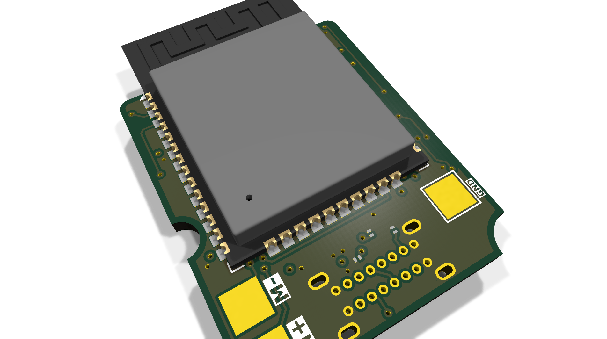
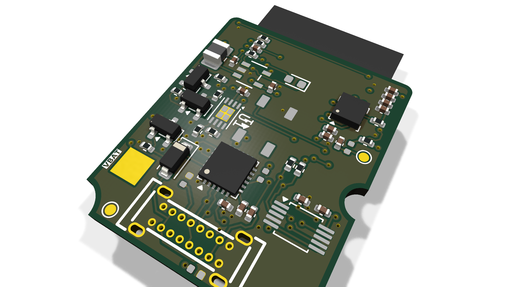

# daronjli_dongle_final_manufactured

Manufactured v1 of the daronjli dongle (frozen snapshot)

## At a Glance

- **Status**: Manufactured
- **Board size**: (unknown)
- **Layers**: 4
- **Components**: ?
- **Key ICs**:
  - U1: MCP73831-2-MC
  - U2: CP2102N-Axx-xQFN24
  - U3: LIS3DH
  - U4: DRV2605LDGS
  - U5: SY8089AAAC
  - U6: ESP32-WROOM-32E

## Renders

**PCB top**

**PCB bottom**

## Files

- `daronjli_dongle.kicad_pro` - KiCad project
- `daronjli_dongle.kicad_sch` - schematic source
- `daronjli_dongle.kicad_pcb` - PCB layout source
- `reports/schematic.pdf` - full schematic (printable)
- `reports/bom.csv` - bill of materials
- `reports/pcb-top.svg`, `reports/pcb-bottom.svg` - copper artwork
- `reports/board-stats.json` - KiCad-generated board statistics

## Notes

Archival sibling of daronjli-dongle

---

_Renders and metadata auto-generated by `Backup-KiCadProject.ps1` using KiCad 10.0._

